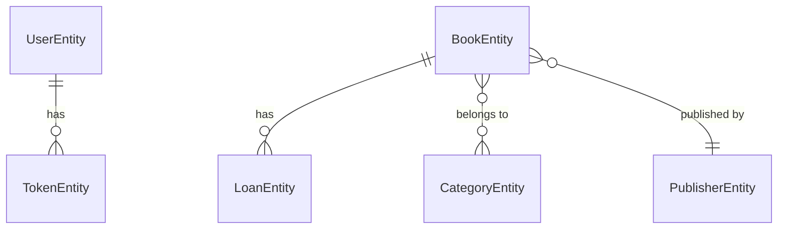

# 🏗️ Multi-Tenant Migration Plan

## 📊 Análisis de Arquitectura Actual

### Entidades Existentes
- **GenericEntity**: Base con soft deletes ✅
- **UserEntity**: Usuarios del sistema 
- **RoleEntity**: Roles de usuario
- **TokenEntity**: Tokens de autenticación
- **BookEntity**: Libros de la biblioteca
- **CategoryEntity**: Categorías de libros
- **PublisherEntity**: Editoriales  
- **LoanEntity**: Préstamos de libros

### Relaciones Identificadas


## 🎯 Objetivos de la Migración

1. **Aislamiento completo** entre escuelas (tenants)
2. **Demo funcional** con datos de ejemplo
3. **Subdominios** por tenant (`escuela1.tuapp.com`)
4. **Panel admin** para gestionar tenants
5. **Arquitectura escalable** para 100+ escuelas

## 📋 Plan de Implementación

### FASE 1: Fundaciones Multi-tenant (feat/multitenant-foundations)
**Duración estimada: 1 semana**

#### 1.1 Crear entidad Tenant
- [ ] `TenantEntity` con subdomain, configuraciones
- [ ] Seed data para tenant demo
- [ ] Migraciones de base de datos

#### 1.2 Actualizar GenericEntity
- [ ] Agregar `tenant_id` a GenericEntity
- [ ] Crear `MultiTenantEntity` base
- [ ] Índices compuestos para performance

#### 1.3 Middleware de tenant detection  
- [ ] Detección por subdomain/header
- [ ] Inyección automática de tenant_id
- [ ] Guards de seguridad

---

### FASE 2: Migrar Core Entities (feat/multitenant-core-entities)
**Duración estimada: 4-5 días**

#### 2.1 Migrar entidades principales
- [ ] `UserEntity` → multi-tenant
- [ ] `TokenEntity` → multi-tenant  
- [ ] `RoleEntity` → multi-tenant (roles por tenant)

#### 2.2 Actualizar servicios existentes
- [ ] `GenericService` → `MultiTenantService`
- [ ] Todos los servicios heredan tenant_id automático
- [ ] Tests de isolation

---

### FASE 3: Migrar Book System (feat/multitenant-book-system)
**Duración estimada: 3-4 días**

#### 3.1 Entidades del sistema bibliotecario
- [ ] `BookEntity` → multi-tenant
- [ ] `CategoryEntity` → multi-tenant
- [ ] `PublisherEntity` → multi-tenant
- [ ] `LoanEntity` → multi-tenant

#### 3.2 Servicios específicos
- [ ] BookService con tenant isolation
- [ ] CategoryService con tenant isolation
- [ ] LoanService con tenant isolation

---

### FASE 4: Authentication & Authorization (feat/multitenant-auth)
**Duración estimada: 3 días**

#### 4.1 Multi-tenant auth
- [ ] Login por tenant específico
- [ ] JWT con tenant_id incluido
- [ ] Guards que validen tenant access

#### 4.2 Roles por tenant
- [ ] Roles independientes por escuela
- [ ] Super admin cross-tenant
- [ ] Permisos granulares

---

### FASE 5: Frontend Multi-tenant (feat/multitenant-frontend)
**Duración estimada: 1 semana**

#### 5.1 Tenant detection
- [ ] Context provider para tenant
- [ ] Hooks que incluyan tenant automáticamente
- [ ] Routing por subdomain

#### 5.2 UI/UX por tenant
- [ ] Temas por tenant
- [ ] Branding personalizable
- [ ] Configuraciones específicas

---

### FASE 6: Demo & Admin Panel (feat/demo-and-admin)  
**Duración estimada: 3-4 días**

#### 6.1 Demo tenant
- [ ] Tenant demo con datos seed
- [ ] Reset automático de datos demo
- [ ] Limitaciones específicas para demo

#### 6.2 Admin panel
- [ ] CRUD de tenants
- [ ] Métricas por tenant
- [ ] Gestión de configuraciones

---

## 🏗️ Cambios Arquitectónicos Clave

### Nuevo GenericEntity Multi-tenant
```typescript
export abstract class MultiTenantEntity {
  @PrimaryGeneratedColumn()
  id!: number;

  @Column()
  @Index()
  tenant_id!: number;

  @ManyToOne(() => TenantEntity)
  @JoinColumn({ name: 'tenant_id' })
  tenant!: TenantEntity;

  @CreateDateColumn()
  created_at!: Date;

  @UpdateDateColumn()
  updated_at?: Date;

  @DeleteDateColumn({ nullable: true, default: null })
  deleted_at?: Date;
}
```

### Nuevo MultiTenantService
```typescript
export abstract class MultiTenantService<T extends MultiTenantEntity> {
  constructor(protected repository: Repository<T>) {}

  // TODOS los métodos automáticamente incluyen tenant_id
  async findAll(tenantId: number): Promise<T[]> {
    return this.repository.find({
      where: { tenant_id: tenantId, deleted_at: null } as any
    });
  }
  // ...resto de métodos
}
```

## 🔒 Consideraciones de Seguridad

### Row Level Security (Automático)
- Todos los queries filtran por `tenant_id`
- Imposible acceso cross-tenant por error de código
- Guards a nivel de controlador

### Validaciones Críticas
- [ ] Tests de data leakage entre tenants
- [ ] Auditoría de queries cross-tenant
- [ ] Logging de accesos por tenant

## 📊 Testing Strategy

### Tests por fase
- [ ] **Unit tests**: Isolation por tenant
- [ ] **Integration tests**: Cross-tenant security  
- [ ] **E2E tests**: Flujos completos multi-tenant
- [ ] **Load tests**: Performance con múltiples tenants

### Data de testing
- [ ] Fixtures por tenant
- [ ] Cleanup automático entre tests
- [ ] Simulación de subdominios

## 🚀 Deployment Strategy

### Environments
- `develop` → Single tenant (compatibilidad)  
- `staging` → Multi-tenant testing
- `production` → Multi-tenant full

### Database migrations
- [ ] Migrations incrementales y reversibles
- [ ] Scripts de rollback por fase
- [ ] Backup strategy antes de cada fase

## 📈 Métricas de Éxito

### Performance
- [ ] Query time < 200ms con 50+ tenants
- [ ] Memory usage lineal con número de tenants
- [ ] DB connections pooling eficiente

### Funcionalidad  
- [ ] 100% isolation entre tenants
- [ ] Demo funcional 24/7
- [ ] Admin panel operativo

## 🔧 Branch Strategy

```
main
├── develop  
│   ├── feat/multitenant-foundations
│   ├── feat/multitenant-core-entities  
│   ├── feat/multitenant-book-system
│   ├── feat/multitenant-auth
│   ├── feat/multitenant-frontend
│   └── feat/demo-and-admin
```

## ⚠️ Riesgos y Mitigaciones

### Riesgos identificados
- **Data leakage**: Tests exhaustivos de isolation
- **Performance**: Índices adecuados desde el inicio
- **Complexity**: Fase incremental con rollbacks
- **Auth complexity**: Documentación detallada

### Plan de rollback
Cada fase tiene rollback específico documentado en su branch correspondiente.

## 📅 Timeline Estimado

**Total: 3-4 semanas**

| Semana | Fases | Entregable |
|--------|--------|------------|
| 1 | Fase 1-2 | Core multi-tenant |
| 2 | Fase 3-4 | Book system + Auth |
| 3 | Fase 5 | Frontend multi-tenant |
| 4 | Fase 6 + Testing | Demo + Admin + QA |

## ✅ Definition of Done

- [ ] Todos los tests pasan
- [ ] Zero data leakage entre tenants
- [ ] Demo funcional con reset automático  
- [ ] Documentación técnica completa
- [ ] Admin panel operativo
- [ ] Performance benchmarks OK
- [ ] Security audit passed

---

**Próximo paso:** Ejecutar Fase 1 - `feat/multitenant-foundations`